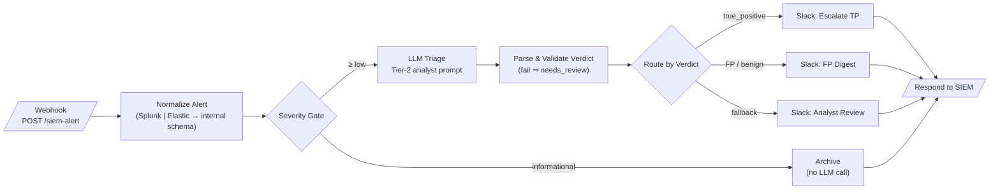
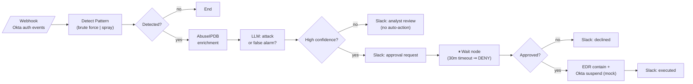

# SOC Automation Workflows for n8n

Ten production-shaped n8n workflows covering the day-to-day automation surface of a Security Operations Center: alert triage, phishing analysis, IOC enrichment, containment with human approval, cloud posture, vulnerability watch, credential leak monitoring, threat intel aggregation, reporting, and insider threat detection.

> **What this is:** a portfolio project demonstrating SOC process knowledge and SOAR-style playbook design on n8n.
> **What this is not:** a drop-in product. All external integrations use placeholder credentials and mock endpoints — see [ARCHITECTURE.md](ARCHITECTURE.md) for the honest list of what you'd need to change to run this against a real environment.

<!-- SCREENSHOT PLACEHOLDER: add a GIF of workflow 01 executing in the n8n canvas here (docs/img/01-triage-demo.gif). Record with LICEcap/ScreenToGif at ~10fps, crop to the canvas. -->

## SOC coverage at a glance

| # | Workflow | Detection | Enrichment | Response | Reporting | LLM-assisted | Human-in-the-loop |
|---|----------|:---------:|:----------:|:--------:|:---------:|:------------:|:-----------------:|
| 01 | [Alert Triage with LLM Verdict](workflows/01-alert-triage-llm/) | | ✅ | | ✅ | ✅ | |
| 02 | [Phishing Email Triage](workflows/02-phishing-email-triage/) | ✅ | ✅ | ✅ | | ✅ | |
| 03 | [IOC Enrichment Pipeline](workflows/03-ioc-enrichment-pipeline/) | | ✅ | | ✅ | | |
| 04 | [Brute-Force → Auto-Containment](workflows/04-bruteforce-auto-containment/) | ✅ | ✅ | ✅ | | ✅ | ✅ |
| 05 | [Cloud Misconfig Drift Detection](workflows/05-cloud-misconfig-drift/) | ✅ | | | ✅ | | |
| 06 | [CVE Watch & Relevance Filter](workflows/06-cve-watch-relevance/) | ✅ | ✅ | | ✅ | ✅ | |
| 07 | [Credential Leak Monitor](workflows/07-credential-leak-monitor/) | ✅ | | ✅ | | | |
| 08 | [Threat Intel Feed Aggregator](workflows/08-threat-intel-aggregator/) | | ✅ | | ✅ | ✅ | |
| 09 | [SOC Daily/Weekly Report Generator](workflows/09-soc-report-generator/) | | | | ✅ | ✅ | |
| 10 | [Insider Threat / Anomalous Access](workflows/10-insider-threat-detection/) | ✅ | | ✅ | | ✅ | |

Every workflow ships with:

- `workflow.json` — importable directly via n8n **Workflows → Import from File**
- `README.md` — what it does, trigger, test payload / `curl` command, MITRE ATT&CK mapping where applicable, and what to change for a real deployment
- `diagram.md` — Mermaid flowchart of the node graph

## Architecture overview

```
        SIEM / IdP / EDR / Email / Feeds
                      │
              (webhook / cron / IMAP)
                      │
   ┌──────────────────▼──────────────────┐
   │                 n8n                 │
   │  normalize → enrich → decide → act  │
   │        │         │        │         │
   │      Code      VT/AIPDB  LLM        │
   │      nodes     Shodan    verdict    │
   └──────┬───────────┬──────────┬───────┘
          │           │          │
        Slack       Jira     Mock EDR/IdP
      (notify)    (ticket)  (containment)
```

The common pattern across all ten playbooks: **normalize** raw vendor input into a stable internal schema, **enrich** with threat intel, let deterministic logic gate what reaches the **LLM** (verdicts and summaries only — never containment), and require **human approval** before any destructive action.

## Example playbooks

Two representative flows rendered from the actual node graphs (every workflow folder has its own `diagram.md` like these):

### 01 — Alert Triage with LLM Verdict



The safety property to notice: a malformed LLM response can only ever route to *analyst review* — never to a default verdict.

### 04 — Brute-Force → Auto-Containment (Human-in-the-Loop)



Automation proposes, a named human approves, and timeout means no action — the pattern I'd defend in a design review.

## Quick start

1. Run n8n locally:
   ```bash
   docker run -it --rm -p 5678:5678 -v n8n_data:/home/node/.n8n docker.n8n.io/n8nio/n8n
   ```
2. Import any `workflows/*/workflow.json` via **Workflows → Import from File**.
3. Create the placeholder credentials the workflow references (each node names what it needs, e.g. `VirusTotal API - PLACEHOLDER`). See [.env.example](.env.example) for the full list.
4. Fire the test payload from that workflow's README with `curl`.

Validate all workflow files at any time:

```bash
node scripts/validate-workflows.js
```

## Design principles

- **LLMs advise, humans decide.** No workflow lets a model output trigger a containment action directly; workflow 04 shows the approval gate pattern explicitly.
- **Normalize early.** Splunk and Elastic emit different shapes; every pipeline converts to one internal alert schema in its first Code node so downstream logic is vendor-agnostic.
- **Fail visibly.** Enrichment API errors degrade to `"lookup_failed"` fields rather than dropping the alert silently.
- **No secrets in JSON.** Credentials are n8n credential references with `PLACEHOLDER` names; endpoints that would be internal are clearly-fake `*.example.com` hosts.

## Repository layout

```
soc-n8n-workflows/
├── README.md              ← you are here
├── ARCHITECTURE.md        ← design decisions, n8n vs. XSOAR, honest limitations
├── LICENSE                (MIT)
├── .env.example
├── workflows/
│   ├── 01-alert-triage-llm/
│   │   ├── workflow.json
│   │   ├── README.md
│   │   └── diagram.md
│   └── ... (02–10, same structure)
└── scripts/
    └── validate-workflows.js
```

## License

MIT — see [LICENSE](LICENSE).
