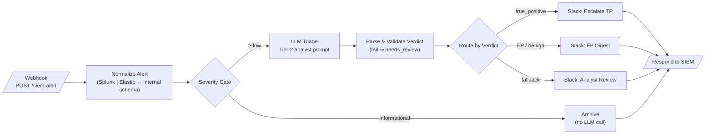
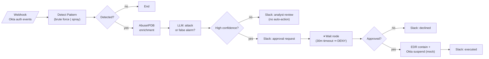

<div align="center">

  <h1>🛡️ SOC n8n Workflows</h1>

  <p><em>Ten production-shaped SOAR playbooks on n8n — triage, enrichment, containment, reporting</em></p>

  <p>
    <a href="LICENSE"></a>
    
    
    
    <a href="scripts/validate-workflows.js"></a>
  </p>

  <br />

  <table>
    <tr>
      <td align="center"><strong>Detection</strong><br/><code>04 05 06 07 10</code></td>
      <td align="center"><strong>Enrichment</strong><br/><code>01 02 03 08 11</code></td>
      <td align="center"><strong>Response</strong><br/><code>02 04 07 10</code></td>
      <td align="center"><strong>Reporting</strong><br/><code>03 05 06 08 09</code></td>
    </tr>
    <tr>
      <td align="center">Brute-force, drift,<br/>insider risk</td>
      <td align="center">VT · AbuseIPDB ·<br/>LLM verdicts</td>
      <td align="center">Human-approved<br/>containment</td>
      <td align="center">Digests, bulletins,<br/>KPI reports</td>
    </tr>
  </table>
</div>

<br />

---

## What is this?

Twelve n8n workflows covering the day-to-day automation surface of a Security Operations Center — ten classic SOAR playbooks, an **agentic triage agent** (AI Agent node with a read-only toolset), and a global error handler. Each one imports directly into n8n (**Workflows → Import from File**) and ships with its own README (test `curl`, MITRE ATT&CK mapping, production notes) and a Mermaid diagram.

All webhook playbooks are production-hardened: shared-secret header auth, **respond-202-before-slow-work** (no sender timeouts, no duplicate redeliveries), replay dedup, LLM token caps + timeouts + retries, retry-with-tolerance on notification/ticket nodes, structured audit logging, and a linkable error workflow.

> **What this is:** a portfolio project demonstrating SOC process knowledge and SOAR-style playbook design on n8n.
> **What this is not:** a drop-in product. Integrations use placeholder credentials and mock endpoints — [ARCHITECTURE.md](ARCHITECTURE.md) lists honestly what a real deployment changes.

<!-- SCREENSHOT PLACEHOLDER: GIF of workflow 01 executing in the n8n canvas (docs/img/01-triage-demo.gif) -->

| # | Workflow | Detection | Enrichment | Response | Reporting | LLM | Human-in-loop |
|---|----------|:---:|:---:|:---:|:---:|:---:|:---:|
| 00 | [Global Error Handler](workflows/00-error-handler/) | | | | ✅ | ✅ | |
| 01 | [Alert Triage with LLM Verdict](workflows/01-alert-triage-llm/) | | ✅ | | ✅ | ✅ | |
| 02 | [Phishing Email Triage](workflows/02-phishing-email-triage/) | ✅ | ✅ | ✅ | | ✅ | |
| 03 | [IOC Enrichment Pipeline](workflows/03-ioc-enrichment-pipeline/) | | ✅ | | ✅ | | |
| 04 | [Brute-Force → Auto-Containment](workflows/04-bruteforce-auto-containment/) | ✅ | ✅ | ✅ | | ✅ | ✅ |
| 05 | [Cloud Misconfig Drift Detection](workflows/05-cloud-misconfig-drift/) | ✅ | | | ✅ | | |
| 06 | [CVE Watch & Relevance Filter](workflows/06-cve-watch-relevance/) | ✅ | ✅ | | ✅ | ✅ | |
| 07 | [Credential Leak Monitor](workflows/07-credential-leak-monitor/) | ✅ | | ✅ | | | |
| 08 | [Threat Intel Feed Aggregator](workflows/08-threat-intel-aggregator/) | | ✅ | | ✅ | ✅ | |
| 09 | [SOC Weekly Report Generator](workflows/09-soc-report-generator/) | | | | ✅ | ✅ | |
| 10 | [Insider Threat / Anomalous Access](workflows/10-insider-threat-detection/) | ✅ | | ✅ | | ✅ | |
| 11 | [Agentic Triage Agent (ReAct)](workflows/11-agentic-triage-agent/) | | ✅ | | ✅ | 🤖 agent | |

---

## Architecture

```
        SIEM / IdP / EDR / Email / Feeds
                      │
              (webhook / cron / IMAP)
                      │
   ┌──────────────────▼──────────────────┐
   │                 n8n                 │
   │  normalize → enrich → decide → act  │
   │        │         │        │         │
   │      Code      VT/AIPDB  LLM        │
   │      nodes     Shodan    verdict    │
   └──────┬───────────┬──────────┬───────┘
          │           │          │
        Slack       Jira     Mock EDR/IdP
      (notify)    (ticket)  (containment)
```

The common pattern across all ten playbooks: **normalize** raw vendor input into a stable internal schema, **enrich** with threat intel, let deterministic logic gate what reaches the **LLM** (verdicts and summaries only — never containment), and require **human approval** before any destructive action.

### Example: 01 — Alert Triage with LLM Verdict



A malformed LLM response can only ever route to *analyst review* — never to a default verdict.

### Example: 04 — Brute-Force → Auto-Containment (Human-in-the-Loop)



Automation proposes, a named human approves, and timeout means no action. Every workflow folder has its own `diagram.md` like these.

---

## Quick Start

### 1. Run n8n

```bash
docker run -it --rm -p 5678:5678 -v n8n_data:/home/node/.n8n docker.n8n.io/n8nio/n8n
```

### 2. Import & configure

Import any `workflows/*/workflow.json` via **Workflows → Import from File**, then create the placeholder credentials the nodes name (e.g. `VirusTotal API - PLACEHOLDER`). Full list in [.env.example](.env.example).

### 3. Fire a test payload

```bash
curl -X POST "http://localhost:5678/webhook/siem-alert" \
  -H "Content-Type: application/json" \
  -d '{"search_name":"ESCU - Encoded PowerShell","result":{"severity":"high","host":"WKS-042","user":"j.smith","src_ip":"10.20.14.55"}}'
```

> Each workflow README has realistic Splunk/Elastic/Okta-shaped payloads. Validate all files anytime: `node scripts/validate-workflows.js`

---

## Design Principles

| Principle | In practice |
|---|---|
| **LLMs advise, humans decide** | No model output triggers containment; workflow 04 shows the approval gate (Wait node + resume URL, timeout = deny) |
| **Agents investigate, never act** | Workflow 11's agent gets a read-only toolset, a 6-iteration cap, and an auditable tool trail — containment tools are deliberately absent |
| **Normalize early** | Splunk and Elastic shapes collapse into one internal schema in the first Code node |
| **Ack fast, work async** | Webhooks respond 202 before any LLM/API work and dedup redeliveries — sender timeouts can't cause double-processing |
| **Fail visibly** | TI API outages degrade to `lookup_failed`; notification failures retry then continue flagged; workflow failures page `#soc-automation-health` via [00](workflows/00-error-handler/) |
| **Cost is bounded** | Every LLM call has `maxTokens`, a timeout, and a retry cap; severity/dedup gates run *before* the model |
| **Facts beat prose** | Numbers and IOCs always come from Code nodes; LLM writes only the words around them |
| **No secrets in JSON** | Placeholder credential refs + `*.example.com` mock endpoints — enforced by the validator |

<details>
<summary><strong>Repository layout</strong></summary>

```
soc-n8n-workflows/
├── README.md              ← you are here
├── ARCHITECTURE.md        design decisions, n8n vs. XSOAR, honest limitations
├── LICENSE                MIT
├── .env.example           every credential, mapped to the workflows using it
├── workflows/
│   ├── 01-alert-triage-llm/
│   │   ├── workflow.json  importable n8n export
│   │   ├── README.md      what/trigger/test/MITRE/production notes
│   │   └── diagram.md     mermaid flowchart
│   └── ... (02–10, same structure)
└── scripts/
    └── validate-workflows.js
```

</details>

---

## Links

| Resource | Where |
|---|---|
| **Design decisions & n8n vs. XSOAR** | [ARCHITECTURE.md](ARCHITECTURE.md) |
| **Credential template** | [.env.example](.env.example) |
| **Workflow validator** | [scripts/validate-workflows.js](scripts/validate-workflows.js) |
| **License** | [LICENSE](LICENSE) (MIT) |

<br />

<div align="center">
  <sub>Built as a SOC automation portfolio · n8n · MIT</sub>
</div>
