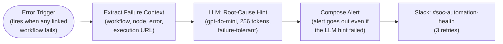

# 00 — Global Error Handler — Flow

```mermaid
flowchart LR
    A(["Error Trigger<br/>(fires when any linked<br/>workflow fails)"]) --> B["Extract Failure Context<br/>(workflow, node, error,<br/>execution URL)"]
    B --> C["LLM: Root-Cause Hint<br/>(gpt-4o-mini, 256 tokens,<br/>failure-tolerant)"]
    C --> D["Compose Alert<br/>(alert goes out even if<br/>the LLM hint failed)"]
    D --> E["Slack: #soc-automation-health<br/>(3 retries)"]
```
