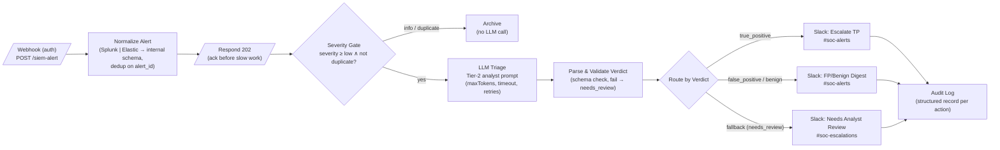

# 01 — Alert Triage with LLM Verdict — Flow

```mermaid
flowchart LR
    A[/"Webhook (auth)<br/>POST /siem-alert"/] --> B["Normalize Alert<br/>(Splunk | Elastic → internal schema,<br/>dedup on alert_id)"]
    B --> R[/"Respond 202<br/>(ack before slow work)"/]
    R --> C{"Severity Gate<br/>severity ≥ low ∧ not duplicate?"}
    C -- "info / duplicate" --> H["Archive<br/>(no LLM call)"]
    C -- "yes" --> D["LLM Triage<br/>Tier-2 analyst prompt<br/>(maxTokens, timeout, retries)"]
    D --> E["Parse & Validate Verdict<br/>(schema check, fail → needs_review)"]
    E --> F{"Route by Verdict"}
    F -- "true_positive" --> G1["Slack: Escalate TP<br/>#soc-alerts"]
    F -- "false_positive / benign" --> G2["Slack: FP/Benign Digest<br/>#soc-alerts"]
    F -- "fallback (needs_review)" --> G3["Slack: Needs Analyst Review<br/>#soc-escalations"]
    G1 --> L["Audit Log<br/>(structured record per action)"]
    G2 --> L
    G3 --> L
```
