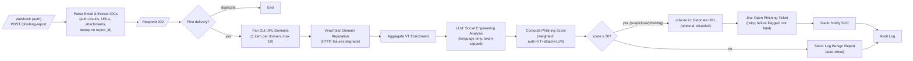

# 02 — Phishing Email Triage — Flow

```mermaid
flowchart LR
    A[/"Webhook (auth)<br/>POST /phishing-report"/] --> B["Parse Email & Extract IOCs<br/>(auth results, URLs, attachments,<br/>dedup on report_id)"]
    B --> R[/"Respond 202"/]
    R --> Q{"First delivery?"}
    Q -- "duplicate" --> Z["End"]
    Q -- "yes" --> C["Fan Out URL Domains<br/>(1 item per domain, max 10)"]
    C --> D["VirusTotal: Domain Reputation<br/>(HTTP, failures degrade)"]
    D --> E["Aggregate VT Enrichment"]
    E --> F["LLM: Social Engineering Analysis<br/>(language only, token-capped)"]
    F --> G["Compute Phishing Score<br/>(weighted: auth+VT+attach+LLM)"]
    G --> H{"score ≥ 30?"}
    H -- "yes (suspicious/phishing)" --> U["urlscan.io: Detonate URL<br/>(optional, disabled)"]
    U --> I["Jira: Open Phishing Ticket<br/>(retry; failure flagged, not fatal)"]
    I --> J["Slack: Notify SOC"]
    H -- "no" --> K["Slack: Log Benign Report<br/>(auto-close)"]
    J --> L["Audit Log"]
    K --> L
```
