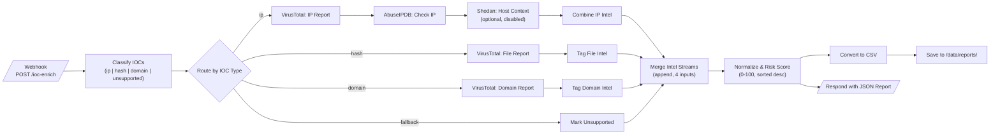

# 03 — IOC Enrichment Pipeline — Flow

```mermaid
flowchart LR
    A[/"Webhook<br/>POST /ioc-enrich"/] --> B["Classify IOCs<br/>(ip | hash | domain | unsupported)"]
    B --> C{"Route by IOC Type"}
    C -- "ip" --> D1["VirusTotal: IP Report"]
    D1 --> D2["AbuseIPDB: Check IP"]
    D2 --> D3["Shodan: Host Context<br/>(optional, disabled)"]
    D3 --> D4["Combine IP Intel"]
    C -- "hash" --> E1["VirusTotal: File Report"]
    E1 --> E2["Tag File Intel"]
    C -- "domain" --> F1["VirusTotal: Domain Report"]
    F1 --> F2["Tag Domain Intel"]
    C -- "fallback" --> G["Mark Unsupported"]
    D4 --> M["Merge Intel Streams<br/>(append, 4 inputs)"]
    E2 --> M
    F2 --> M
    G --> M
    M --> N["Normalize & Risk Score<br/>(0-100, sorted desc)"]
    N --> O["Convert to CSV"] --> P["Save to /data/reports/"]
    N --> R[/"Respond with JSON Report"/]
```
