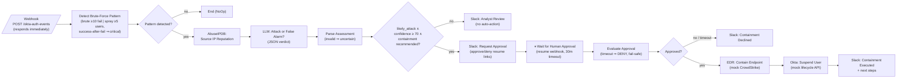

# 04 — Brute-Force → Auto-Containment — Flow

```mermaid
flowchart LR
    A[/"Webhook<br/>POST /okta-auth-events<br/>(responds immediately)"/] --> B["Detect Brute-Force Pattern<br/>(brute ≥10 fail | spray ≥5 users,<br/>success-after-fail ⇒ critical)"]
    B --> C{"Pattern detected?"}
    C -- "no" --> Z["End (NoOp)"]
    C -- "yes" --> D["AbuseIPDB:<br/>Source IP Reputation"]
    D --> E["LLM: Attack or False Alarm?<br/>(JSON verdict)"]
    E --> F["Parse Assessment<br/>(invalid ⇒ uncertain)"]
    F --> G{"likely_attack ∧<br/>confidence ≥ 70 ∧<br/>containment recommended?"}
    G -- "no" --> H["Slack: Analyst Review<br/>(no auto-action)"]
    G -- "yes" --> I["Slack: Request Approval<br/>(approve/deny resume links)"]
    I --> W["⏸ Wait for Human Approval<br/>(resume webhook, 30m timeout)"]
    W --> J["Evaluate Approval<br/>(timeout ⇒ DENY, fail-safe)"]
    J --> K{"Approved?"}
    K -- "no / timeout" --> L["Slack: Containment Declined"]
    K -- "yes" --> M["EDR: Contain Endpoint<br/>(mock CrowdStrike)"]
    M --> N["Okta: Suspend User<br/>(mock lifecycle API)"]
    N --> O["Slack: Containment Executed<br/>+ next steps"]
```
