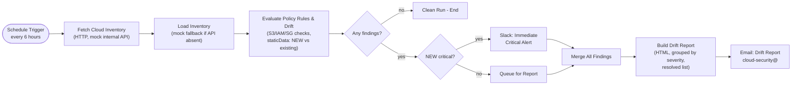

# 05 — Cloud Misconfig Drift Detection — Flow

```mermaid
flowchart LR
    A(["Schedule Trigger<br/>every 6 hours"]) --> B["Fetch Cloud Inventory<br/>(HTTP, mock internal API)"]
    B --> C["Load Inventory<br/>(mock fallback if API absent)"]
    C --> D["Evaluate Policy Rules & Drift<br/>(S3/IAM/SG checks,<br/>staticData: NEW vs existing)"]
    D --> E{"Any findings?"}
    E -- "no" --> F["Clean Run - End"]
    E -- "yes" --> G{"NEW critical?"}
    G -- "yes" --> H["Slack: Immediate<br/>Critical Alert"]
    G -- "no" --> I["Queue for Report"]
    H --> M["Merge All Findings"]
    I --> M
    M --> N["Build Drift Report<br/>(HTML, grouped by severity,<br/>resolved list)"]
    N --> O["Email: Drift Report<br/>cloud-security@"]
```
