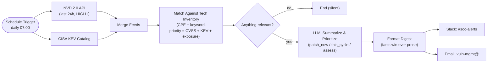

# 06 — CVE Watch & Relevance Filter — Flow

```mermaid
flowchart LR
    A(["Schedule Trigger<br/>daily 07:00"]) --> B["NVD 2.0 API<br/>(last 24h, HIGH+)"]
    A --> C["CISA KEV Catalog"]
    B --> M["Merge Feeds"]
    C --> M
    M --> D["Match Against Tech Inventory<br/>(CPE + keyword,<br/>priority = CVSS + KEV + exposure)"]
    D --> E{"Anything relevant?"}
    E -- "no" --> F["End (silent)"]
    E -- "yes" --> G["LLM: Summarize & Prioritize<br/>(patch_now / this_cycle / assess)"]
    G --> H["Format Digest<br/>(facts win over prose)"]
    H --> I["Slack: #soc-alerts"]
    H --> J["Email: vuln-mgmt@"]
```
