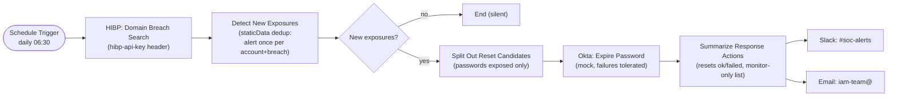

# 07 — Credential Leak Monitor — Flow

```mermaid
flowchart LR
    A(["Schedule Trigger<br/>daily 06:30"]) --> B["HIBP: Domain Breach Search<br/>(hibp-api-key header)"]
    B --> C["Detect New Exposures<br/>(staticData dedup:<br/>alert once per account+breach)"]
    C --> D{"New exposures?"}
    D -- "no" --> E["End (silent)"]
    D -- "yes" --> F["Split Out Reset Candidates<br/>(passwords exposed only)"]
    F --> G["Okta: Expire Password<br/>(mock, failures tolerated)"]
    G --> H["Summarize Response Actions<br/>(resets ok/failed, monitor-only list)"]
    H --> I["Slack: #soc-alerts"]
    H --> J["Email: iam-team@"]
```
