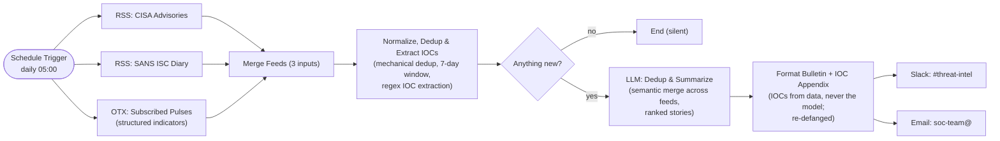

# 08 — Threat Intel Feed Aggregator — Flow

```mermaid
flowchart LR
    A(["Schedule Trigger<br/>daily 05:00"]) --> B["RSS: CISA Advisories"]
    A --> C["RSS: SANS ISC Diary"]
    A --> D["OTX: Subscribed Pulses<br/>(structured indicators)"]
    B --> M["Merge Feeds (3 inputs)"]
    C --> M
    D --> M
    M --> E["Normalize, Dedup & Extract IOCs<br/>(mechanical dedup, 7-day window,<br/>regex IOC extraction)"]
    E --> F{"Anything new?"}
    F -- "no" --> G["End (silent)"]
    F -- "yes" --> H["LLM: Dedup & Summarize<br/>(semantic merge across feeds,<br/>ranked stories)"]
    H --> I["Format Bulletin + IOC Appendix<br/>(IOCs from data, never the model;<br/>re-defanged)"]
    I --> J["Slack: #threat-intel"]
    I --> K["Email: soc-team@"]
```
