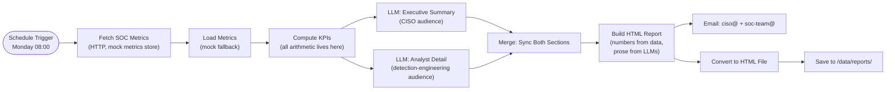

# 09 — SOC Weekly Report Generator — Flow

```mermaid
flowchart LR
    A(["Schedule Trigger<br/>Monday 08:00"]) --> B["Fetch SOC Metrics<br/>(HTTP, mock metrics store)"]
    B --> C["Load Metrics<br/>(mock fallback)"]
    C --> D["Compute KPIs<br/>(all arithmetic lives here)"]
    D --> E["LLM: Executive Summary<br/>(CISO audience)"]
    D --> F["LLM: Analyst Detail<br/>(detection-engineering audience)"]
    E --> G["Merge: Sync Both Sections"]
    F --> G
    G --> H["Build HTML Report<br/>(numbers from data,<br/>prose from LLMs)"]
    H --> I["Email: ciso@ + soc-team@"]
    H --> J["Convert to HTML File"]
    J --> K["Save to /data/reports/"]
```
