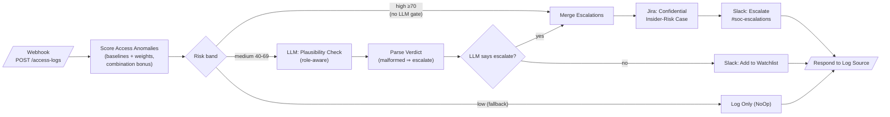

# 10 — Insider Threat / Anomalous Access Detection — Flow

```mermaid
flowchart LR
    A[/"Webhook<br/>POST /access-logs"/] --> B["Score Access Anomalies<br/>(baselines + weights,<br/>combination bonus)"]
    B --> C{"Risk band"}
    C -- "high ≥70<br/>(no LLM gate)" --> M["Merge Escalations"]
    C -- "medium 40-69" --> D["LLM: Plausibility Check<br/>(role-aware)"]
    D --> E["Parse Verdict<br/>(malformed ⇒ escalate)"]
    E --> F{"LLM says escalate?"}
    F -- "yes" --> M
    F -- "no" --> G["Slack: Add to Watchlist"]
    C -- "low (fallback)" --> H["Log Only (NoOp)"]
    M --> I["Jira: Confidential<br/>Insider-Risk Case"]
    I --> J["Slack: Escalate<br/>#soc-escalations"]
    J --> R[/"Respond to Log Source"/]
    G --> R
    H --> R
```
