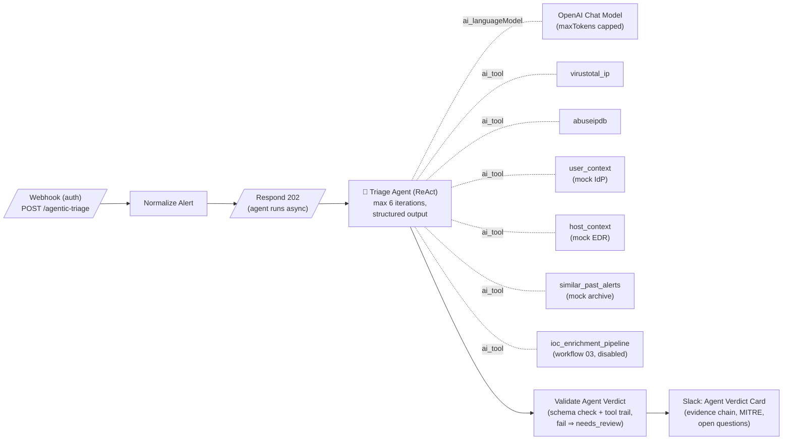

# 11 — Agentic Triage Agent — Flow

```mermaid
flowchart LR
    A[/"Webhook (auth)<br/>POST /agentic-triage"/] --> B["Normalize Alert"]
    B --> R[/"Respond 202<br/>(agent runs async)"/]
    R --> C["🤖 Triage Agent (ReAct)<br/>max 6 iterations,<br/>structured output"]
    C -. "ai_languageModel" .- M["OpenAI Chat Model<br/>(maxTokens capped)"]
    C -. "ai_tool" .- T1["virustotal_ip"]
    C -. "ai_tool" .- T2["abuseipdb"]
    C -. "ai_tool" .- T3["user_context<br/>(mock IdP)"]
    C -. "ai_tool" .- T4["host_context<br/>(mock EDR)"]
    C -. "ai_tool" .- T5["similar_past_alerts<br/>(mock archive)"]
    C -. "ai_tool" .- T6["ioc_enrichment_pipeline<br/>(workflow 03, disabled)"]
    C --> D["Validate Agent Verdict<br/>(schema check + tool trail,<br/>fail ⇒ needs_review)"]
    D --> E["Slack: Agent Verdict Card<br/>(evidence chain, MITRE,<br/>open questions)"]
```

The agent deliberately has **no containment tools** — read-only investigation, human-owned response.
